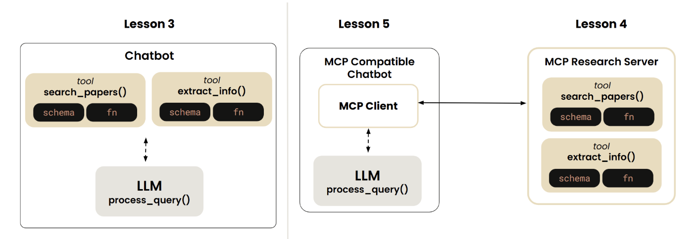
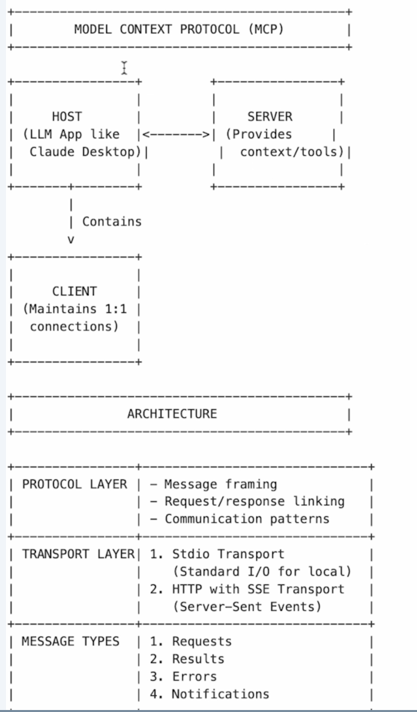
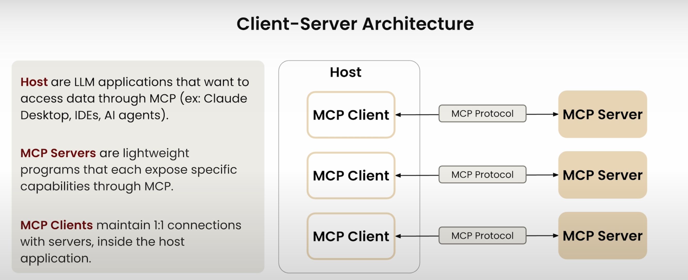
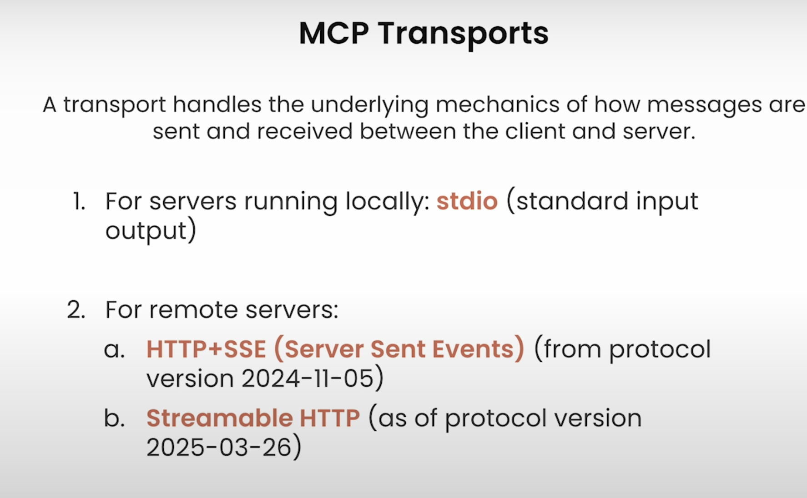
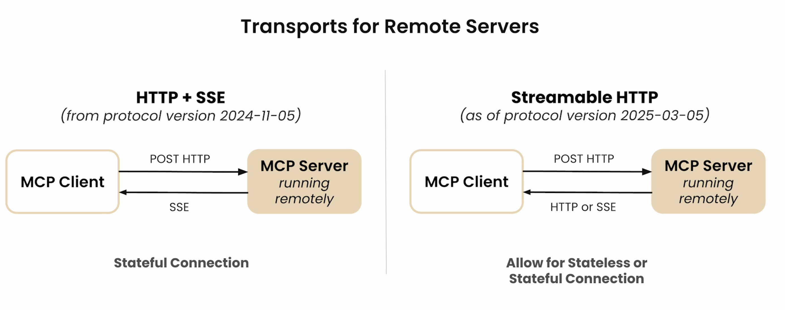
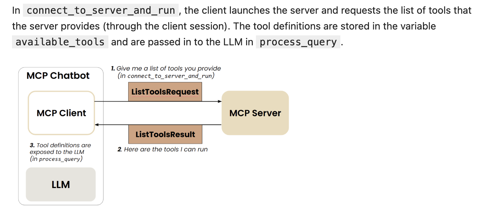
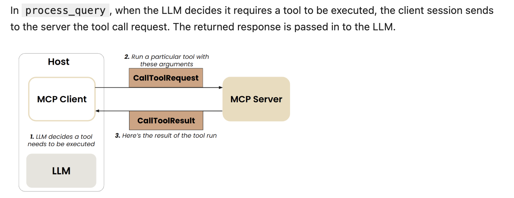
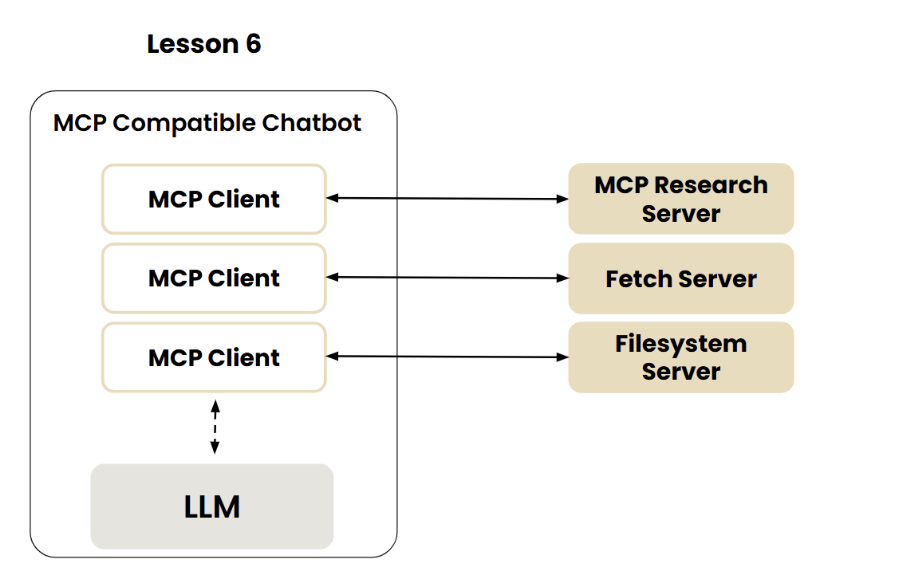
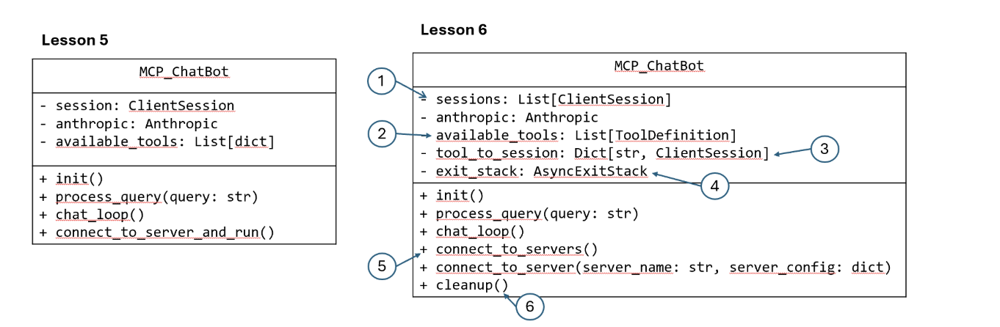

Overview of the MCP Server Architecture:




MCP Transports:




# MCP server: research_server*.py

Launch the inspector to do the debug of mcp tools:
```bash
npx @modelcontextprotocol/inspector uv run research_server.py
```

# MCP client: mcp_chatbot*.py

Connect_to_server_and_run:

(the MCP client automatically manages the server's lifecycle - it starts the server subprocess when entering the context manager and cleans it up when exiting. You don't need to manually start research_server.py separately; the client handles that for you.)

Process Query:


## extend the MCP chatbot to Reference Servers


Updated MCP chatbot

1. Instead of having one session, you now have a list of client sessions where each client session establishes a 1-to-1 connection to each server;
2. `available_tools` includes the definitions of all the tools exposed by all servers that the chatbot can connect to.
3. `tool_to_session` maps the tool name to the corresponding client session; in this way, when the LLM decides on a particular tool name, you can map it to the correct client session so you can use that session to send `tool_call` request to the right MCP server.
4. `exit_stack` is a context manager that will manage the mcp client objects and their sessions and ensures that they are properly closed. In lesson 5, you did not use it because you used the `with` statement which behind the scenes uses a context manager. Here you could again use the `with` statement, but you may end up using multiple nested `with` statements since you have multiple servers to connect to. `exit_stack` allows you to dynamically add the mcp clients and their sessions as you'll see in the code below.
5. `connect_to_servers` reads the server configuration file and for each single server, it calls the helper method `connect_to_server`. In this latter method, an MCP client is created and used to launch the server as a **sub-process** and then a client session is created to connect to the server and get a description of the list of the tools provided by the server.
6. `cleanup` is a helper method that ensures all your connections are properly shut down when you're done with them. In lesson 5, you relied on the `with` statement to automatically clean up resources. This cleanup method serves a similar purpose, but for all the resources you've added to your exit_stack; it closes (your MCP clients and sessions) in the reverse order they were added - like stacking and unstacking plates. This is particularly important in network programming to avoid resource leaks.

## Adding Prompt and Resource Features
- Resources
Resources are similar to GET endpoints in a REST API - they provide data but shouldn't perform significant computation or have side effects.
- Prompt Template


# how to run/debug in local
```bash
uv run mcp_chatbot*.py
```

sample prompt:
```
Fetch the content of this website: https://modelcontextprotocol.io/docs/concepts/architecture and save the content in the file "mcp_summary.md", create a visual diagram that summarizes the content of "mcp_summary.md" and save it in a text file
```
```@folders```
```@ai_interpretability```
```prompts```
```prompt generate_search_prompt topic=history num_papers=2```

# Creating and Deploying Remote Servers
1. SSE

You just need to specify that the transport is sse when running the server. You can also specify the port number when initializing the FastMCP server. 

```python
# Initialize FastMCP server
mcp = FastMCP("research", port=8001)
```

```python
if __name__ == "__main__":
    # Initialize and run the server
    mcp.run(transport='sse')
```

2. Streamable HTTP

```python
if __name__ == "__main__":
    # Initialize and run the server
    mcp.run(transport="streamable-http")
```

two options when initiate the FastMCP
```python
# Stateful server (maintains session state)
mcp = FastMCP("research")

# Stateless server (no session persistence)
mcp = FastMCP("research", stateless_http=True)
```

**Stateless** can be used when you want the server to handle simple, independent requests (no memory of previous interactions with the same client). **Stateful** can be used when you want the server to handle multiple requests that are part of a workflow and you want the server to remember the Client information and context across multiple requests.

## how to test and debug the remote server
1. using Inspector UI
2. update MCP chatbot code to connect to a remote server
```python
from mcp.client.sse import sse_client

sse_transport = await self.exit_stack.enter_async_context(
                   sse_client(url= "server_url/sse" )
                )
read, write = sse_transport 
```

or

``` python
from mcp.client.streamable_http import streamablehttp_client
streamable_transport = await self.exit_stack.enter_async_context(
                   streamablehttp_client(url= "server_url/mcp/" )
                )
read, write = streamable_transport 
```

## how to deploy
- render